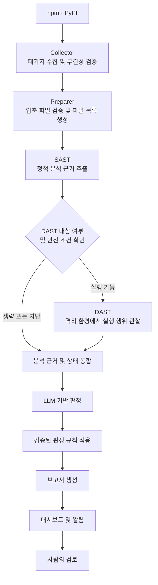

<p align="center">
  
</p>

[English](README.md)

오픈소스 생태계를 위한 근거 기반 악성 패키지 탐지.

smiling-hyena는 npm과 PyPI를 대상으로 악성 패키지 탐지 파이프라인을 개발하는 보안 연구팀입니다.

정적 분석, 격리 환경에서의 실행 행위 관찰, LLM 기반 판정을 결합해 의심스러운 패키지를 조사하고, 근거를 추적할 수 있는 분석 결과를 제공합니다. 자동 탐지와 사람의 검토를 연결하여, 패키지가 어떤 동작을 수행하고 왜 주의가 필요한지 이해할 수 있도록 돕습니다.

## 우리가 하는 일

새롭게 배포되는 패키지를 수집하고 잠재적으로 유해한 동작을 조사하여, 검토와 대응에 활용할 수 있는 보고서로 정리합니다.

### smiling-hyena의 강점

- **맥락을 고려한 동작 이해:** 패키지가 어떤 동작을 수행하려는지, 그 동작이 명시된 목적과 어떻게 연결되는지 평가할 수 있습니다. 서로 보완하는 근거를 함께 제공하여 빠른 검토를 돕고, 개별 신호만으로 판단할 때 발생하는 오탐을 줄이는 것을 목표로 합니다.
- **검증 가능한 판단 근거:** 판정의 근거가 된 코드와 실행 기록을 직접 확인하고, 판정이 변경된 이유를 이해한 뒤 탐지 결과를 받아들일 수 있습니다.
- **명확한 분석 범위와 한계:** 무엇을 분석했고 무엇을 생략했는지, 어떤 근거가 부족한지 확인할 수 있어 관찰하지 못한 결과를 안전하다는 증거로 오해하지 않도록 돕습니다.
- **격리 환경을 활용한 조사:** 전용 실행 환경과 통제 장치를 통해 분석 시스템의 노출을 제한하면서 잠재적으로 유해한 동작을 조사할 수 있습니다.
- **발견부터 검토까지 이어지는 흐름:** 수집한 패키지의 분석, 보고서, 사람의 검토를 하나의 흐름에서 확인하고, 문서화된 결과를 제보 준비에 활용할 수 있습니다.
- **검토 결과를 통한 지속적인 개선:** 확인된 악성 사례와 오탐 검토 결과를 탐지 규칙 및 판정 정책의 개선 방향을 정하는 데 활용합니다.

### 탐지 사례 및 기여

의심스러운 패키지를 조사하고, 확인된 사례마다 판단의 근거를 문서화합니다. 기술 분석과 탐지 기능 개선을 수행하며, 필요한 경우 패키지 레지스트리와 OSSF malicious-packages 데이터베이스에 제보합니다.

#### 확인된 악성 패키지

- **확인된 악성 패키지:** 46

집계 기간: 2026.09.14 ~ 2026.10.04  
집계 기준: 중복을 제거한 패키지·버전 단위  
확인된 악성 패키지는 사람의 검토를 통해 악성으로 확인된 대상입니다.  
아직 보고서가 없는 확정 건도 있어서, 이 저장소의 보고서 수는 이 숫자보다 적습니다.

#### 우리가 발견한 패키지

아래 OSV 기록에서 우리가 발견하고 분석 결과를 기여한 패키지를 확인할 수 있습니다. 여러 연구자가 함께 기여자로 기록된 사례도 포함합니다.

| 패키지 | OSV ID |
|---|---|
| npm/jexkcode | [MAL-2026-16220](https://osv.dev/vulnerability/MAL-2026-16220) |
| npm/radio-player-theme | [MAL-2026-16347](https://osv.dev/vulnerability/MAL-2026-16347) |
| PyPI/my-private-pkg | [MAL-2026-17180](https://osv.dev/vulnerability/MAL-2026-17180) |
| npm/cat-sis2go-utils | [MAL-2026-16071](https://osv.dev/vulnerability/MAL-2026-16071) |
| npm/godsplan | [MAL-2026-17315](https://osv.dev/vulnerability/MAL-2026-17315) |
| npm/@zeronexcode/baileys | [MAL-2026-17326](https://osv.dev/vulnerability/MAL-2026-17326) |
| PyPI/friendly-greeting-tools | [MAL-2026-17416](https://osv.dev/vulnerability/MAL-2026-17416) |
| PyPI/beautifytext | [MAL-2026-17417](https://osv.dev/vulnerability/MAL-2026-17417) |
| PyPI/donutpromotion | [MAL-2026-17196](https://osv.dev/vulnerability/MAL-2026-17196) |
| PyPI/friendly-tools | [MAL-2026-17419](https://osv.dev/vulnerability/MAL-2026-17419) |

> 같은 OSV 기록에 다른 연구자가 기여자로 올라 있으면 그 기록에 함께 표시됩니다. 사례 보고서에는 코드가 무엇을 하는지, 어디에서 언제 실행되는지, 확인한 버전, 발견한 지표를 적습니다. 시험이나 개념 증명으로 보이는 패키지는 나머지와 구분해 둡니다. 보고서는 CC BY 4.0 라이선스이며, 정정은 smilinghyena4@gmail.com 으로 보낼 수 있습니다.

## 파이프라인 및 기술적 특징

### 분석 파이프라인



### 기술적 특징

**Collector · Preparer**

레지스트리 메타데이터와 패키지 파일을 수집하고, 해시·크기 및 압축 항목을 검증합니다. 패키지 코드를 실행하지 않고 압축을 해제해 파일 목록을 생성합니다.

**SAST**

npm의 설치 훅·JavaScript 진입점과 PyPI의 빌드 설정·Python 구문 트리·호출 관계를 분석합니다. 파일 위치, 코드 발췌, 실행 문맥을 포함한 시그널을 생성합니다.

**DAST**

런타임 증명, 대상 선정, 안전 조건을 확인한 뒤 전용 Docker·gVisor 샌드박스에서 실행합니다. 네트워크를 통제하며 프로세스, 파일 시스템, 환경변수, 통신 기록을 수집합니다.

**LLM 판정**

패키지 메타데이터와 SAST·DAST 시그널 묶음으로 `LlmInput`을 구성하며, DAST의 미완료·미수행 상태도 전달합니다. 모델이 판정·사유·인용 시그널 ID를 반환하면 응답 형식과 인용 ID를 검증합니다.

**판정 검증**

근거 간 연결, 실행 문맥, 관찰 범위를 확인하는 규칙을 적용합니다. 규칙 ID, 정책 버전, 원판정을 유지하거나 조정한 이유를 기록합니다.

**Reporter · 검토 기록 저장**

원판정·최종 판정, 시그널 참조, 오류, 제한사항, 단계별 시간을 `AnalysisReport`에 저장합니다. 사람의 검토 결과와 변경 이력은 데이터베이스에 별도로 저장합니다.

**공통 데이터 규격 · 실행 조정**

모듈 간에 버전이 관리되는 데이터 규격을 사용합니다. Worker가 `FETCH`·`PREPARE` 작업을 처리하고, Orchestrator가 준비·SAST·DAST·판정·검증·보고서 생성 순서를 연결합니다.

## 이 저장소의 보고서

smiling-hyena 분석 파이프라인이 찾은 악성 npm·PyPI 패키지입니다.
여기 있는 보고서는 모두 사람이 읽고 확정한 뒤에 추가했으며,
자동 판정만으로는 공개하지 않습니다.

보고서는 [OSV](https://ossf.github.io/osv-schema/) JSON이며 패키지마다 파일 하나입니다.

```
pypi/malicious/osv/<package>.json
pypi/pentest/osv/<package>.json    보안 시험, 개념 증명, CTF 탐침
npm/malicious/osv/<package>.json   (스코프 이름: npm/malicious/osv/@scope/<name>.json)
npm/pentest/osv/<package>.json
withdrawn/                          우리가 틀린 보고서, 사유와 함께 보관
```

`pentest`는 가져가면 안 되는 데이터를 가져가거나 코드를 실행하지만, 공격보다는
시험으로 읽히는 패키지입니다(이름이 시험인 것, CTF 플래그를 빼내는 개념 증명,
콜백만 하는 탐침). 따로 두어서 구분해 볼 수 있게 합니다.

각 보고서에는 패키지가 무엇을 하는지, 코드가 어디에 있고 언제 실행되는지,
확인한 버전, 코드에서 찾은 지표(도메인, URL, IP)가 적혀 있습니다.

인프라나 코드를 공유하는 패키지는 `campaigns/`에 묶고, 각 보고서는
`database_specific.campaign`에 소속 캠페인 이름을 적습니다.

이 저장소에는 설명과 지표만 있습니다. 보고된 패키지의 코드는 담지 않으며 앞으로도 담지 않습니다.

## 잘못된 보고서를 발견하셨나요?

패키지, 버전, 무엇이 잘못됐다고 보시는지를 이슈로 열거나 smilinghyena4@gmail.com 으로 보내 주세요.
코드를 다시 읽고 우리가 틀렸다면 파일을 짧은 사유와 함께 `withdrawn/`으로 옮깁니다.
보고서를 직접 고치는 풀 리퀘스트는 보내지 말아 주세요. 보고서는 검토 기록에서 내보내므로
다음 내보내기에서 변경이 덮어써집니다.

## 면책

보고서는 보증 없이 있는 그대로 공개합니다. 각 보고서는 적힌 버전의 코드를 수동으로 검토한 결과이며,
적히지 않은 다른 버전은 확인하지 않았습니다. 실수가 있을 수 있고, 그래서 위의 절차가 있습니다.

## 라이선스

보고서와 캠페인 파일은 [CC BY 4.0](https://creativecommons.org/licenses/by/4.0/) 라이선스입니다.
smiling-hyena를 출처로 밝히면 어떤 목적으로든 쓸 수 있습니다.

## 팀

패키지 생태계 연구, 악성코드 분석, 보안 엔지니어링 역량을 모아 smiling-hyena를 개발하고 개선합니다.

- [@ben-dh-kim](https://github.com/ben-dh-kim)
- [@eyalyal](https://github.com/eyalyal)
- [@0xAxii](https://github.com/0xAxii)
- [@Juhyeok0603](https://github.com/Juhyeok0603)
- [@justkorean1681](https://github.com/justkorean1681)
- [@OGAREE](https://github.com/OGAREE)
- [@ragon5500-arch](https://github.com/ragon5500-arch)
- [@Ridhdn](https://github.com/Ridhdn)
- [@saic12](https://github.com/saic12)
- [@WOVY](https://github.com/WOVY)

## 연락처

smilinghyena4@gmail.com
