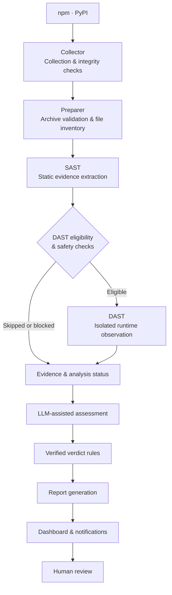

<p align="center">
  
</p>

[한국어](README.ko.md)

Evidence-driven malicious package detection for the open-source ecosystem.

smiling-hyena is a security research team building a malicious package detection pipeline for npm and PyPI.

We combine static analysis, isolated runtime observation, and LLM-assisted assessment to investigate suspicious packages and produce traceable findings. Our work connects automated detection with human review, helping researchers understand what a package does and why it deserves attention.

## What We Do

We collect package releases, investigate potentially harmful behavior, and turn analysis evidence into actionable reports.

### Why smiling-hyena?

- **Understand behavior in context:** Assess what a package is likely doing and how that relates to its stated purpose. Combining complementary evidence helps reviewers interpret suspicious activity, with the goal of faster assessment and fewer false positives from isolated indicators.
- **Verify the reasoning:** Follow each verdict back to its supporting code and runtime observations, and understand why the assessment changed before accepting a finding.
- **Recognize the limits:** See what was analyzed, what was skipped, and where evidence is incomplete, so missing observations are not mistaken for proof of safety.
- **Investigate with isolation:** Examine potentially harmful behavior in a dedicated execution environment, with controls that limit exposure of the analysis system.
- **Move from discovery to review:** Follow collected packages through analysis, reporting, and human review in one workflow, and use documented findings to prepare disclosures.
- **Build on reviewed findings:** Use confirmed cases and false-positive reviews to guide improvements to detection rules and verdict policies.

### Detection & Contributions

We investigate suspicious packages and document the evidence behind each confirmed finding. Our contributions include technical analysis, detection improvements, and reports submitted to package registries and to the OSSF malicious-packages database where applicable.

#### Confirmed Findings

- **Confirmed Malicious Packages:** 46

Reporting period: 2026-09-14 through 2026-10-04  
Counting basis: unique package–version pairs  
Confirmed malicious packages are those verified as malicious through human review.  
Not every confirmed package has a report here yet, so this repository holds fewer reports than this number.

#### Packages We Discovered

The following OSV records document packages we identified and contributed findings on, including cases with multiple credited researchers.

| Package | OSV ID |
|---|---|
| npm/jexkcode | [MAL-2026-16220](https://osv.dev/vulnerability/MAL-2026-16220) |
| npm/radio-player-theme | [MAL-2026-16347](https://osv.dev/vulnerability/MAL-2026-16347) |
| PyPI/my-private-pkg | [MAL-2026-17180](https://osv.dev/vulnerability/MAL-2026-17180) |
| npm/cat-sis2go-utils | [MAL-2026-16071](https://osv.dev/vulnerability/MAL-2026-16071) |
| npm/godsplan | [MAL-2026-17315](https://osv.dev/vulnerability/MAL-2026-17315) |
| npm/@zeronexcode/baileys | [MAL-2026-17326](https://osv.dev/vulnerability/MAL-2026-17326) |
| PyPI/friendly-greeting-tools | [MAL-2026-17416](https://osv.dev/vulnerability/MAL-2026-17416) |
| PyPI/beautifytext | [MAL-2026-17417](https://osv.dev/vulnerability/MAL-2026-17417) |
| PyPI/donutpromotion | [MAL-2026-17196](https://osv.dev/vulnerability/MAL-2026-17196) |
| PyPI/friendly-tools | [MAL-2026-17419](https://osv.dev/vulnerability/MAL-2026-17419) |

>*Where other researchers are credited on the same OSV record, the record lists them. Our case reports describe what the code does, where and when it runs, which versions we checked, and the indicators we found. Packages that look like tests or proofs of concept are kept apart from the rest. Reports are licensed CC BY 4.0, and corrections can be sent to smilinghyena4@gmail.com.*

## Pipeline & Technical Features

### Analysis Pipeline



### Technical Features

**Collector & Preparer**

Collect registry metadata and package artifacts, validate hashes and sizes, check archive entries, and produce an inventory of extracted files without executing package code.

**SAST**

Inspect npm installation hooks and JavaScript entry points, and analyze PyPI build settings, Python syntax trees, and call relationships. Emit signals with file locations, code excerpts, and execution context.

**DAST**

Check runtime attestation, eligibility, and safety conditions before execution in a dedicated Docker and gVisor sandbox. Collect process, filesystem, environment, and network observations under controlled networking.

**LLM assessment**

Construct `LlmInput` from package metadata and SAST/DAST signal bundles, including incomplete or unavailable DAST states. The model returns a verdict, rationale, and cited signal IDs; validate the response format and citation IDs.

**Verdict validation**

Apply rules that check evidence connections, execution context, and observation scope. Record rule IDs, policy versions, and reasons for retaining or adjusting the original verdict.

**Reporter & review storage**

Store original and final verdicts, signal references, errors, limitations, and stage timings in `AnalysisReport`. Store human review results and change history separately in the database.

**Shared contracts & orchestration**

Exchange versioned data contracts between modules. Workers process `FETCH` and `PREPARE` jobs, while the orchestrator sequences preparation, SAST, DAST, assessment, validation, and reporting.

## Reports in This Repository

Malicious npm and PyPI packages found by the smiling-hyena analysis pipeline.
Every report here was read and confirmed by a person before it was added;
an automated verdict on its own is never published.

Reports are [OSV](https://ossf.github.io/osv-schema/) JSON, one file per package:

```
pypi/malicious/osv/<package>.json
pypi/pentest/osv/<package>.json    security tests, proofs of concept, CTF probes
npm/malicious/osv/<package>.json   (scoped names: npm/malicious/osv/@scope/<name>.json)
npm/pentest/osv/<package>.json
withdrawn/                          reports we got wrong, kept with a note
```

`pentest` holds packages that still take data or run code they should not, but read
as testing rather than an attack (named as a test, a PoC exfiltrating CTF flags, a
callback-only probe). They are kept apart so they can be weighed separately.

Each report says what the package does, where the code is and when it runs,
which versions were checked, and any indicators (domains, URLs, IPs) found in it.

Packages that share infrastructure or code are grouped in `campaigns/`, and each
member report names its campaign under `database_specific.campaign`.

This repository holds descriptions and indicators only. It does not and will not
contain the code of any reported package.

## Wrong report?

Open an issue or email smilinghyena4@gmail.com with the package, version and
what you think is wrong. We read the code again and, if we were wrong, move the
file to `withdrawn/` with a short note on why. Please do not send a pull request
that edits a report directly: reports are exported from our review records, and
the next export would overwrite the change.

## Disclaimer

Reports are published as they are, without warranty. Each one reflects a manual
review of the code at the version listed; other versions were not checked unless
they are listed too. Mistakes are possible, which is why the process above exists.

## License

The reports and campaign files are licensed under
[CC BY 4.0](https://creativecommons.org/licenses/by/4.0/): you may use them for
any purpose as long as you credit smiling-hyena as the source.

## Team

We bring together package ecosystem research, malware analysis, and security engineering to build and improve smiling-hyena.

- [@ben-dh-kim](https://github.com/ben-dh-kim)
- [@eyalyal](https://github.com/eyalyal)
- [@0xAxii](https://github.com/0xAxii)
- [@Juhyeok0603](https://github.com/Juhyeok0603)
- [@justkorean1681](https://github.com/justkorean1681)
- [@OGAREE](https://github.com/OGAREE)
- [@ragon5500-arch](https://github.com/ragon5500-arch)
- [@Ridhdn](https://github.com/Ridhdn)
- [@saic12](https://github.com/saic12)
- [@WOVY](https://github.com/WOVY)

## Contact

smilinghyena4@gmail.com
